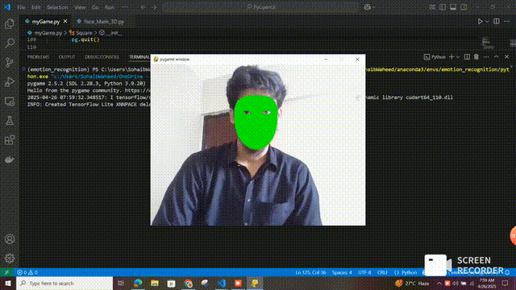

# 🛡️ Real-Time Face Mask Overlay using MediaPipe and PyOpenGL

An AI-based system that detects facial landmarks using MediaPipe's Face Mesh and draws a 3D mask over the face using PyOpenGL in real-time.

---

## 🧠 Overview

This project combines computer vision and graphics to overlay a digital face mask aligned perfectly with your facial structure.

### 🔍 Pipeline:
- **MediaPipe Face Mesh** detects 468 facial landmarks in real-time.
- Landmark data is then passed to **PyOpenGL**.
- PyOpenGL renders a smooth, semi-transparent face mask directly on top of the detected face.

---

## 🎥 Demo

---

## ✨ Features

- Accurate and fast facial landmark detection (eyes, nose, chin, jawline, etc.)
- Real-time rendering of a graphical mask that adapts to facial movement
- Smooth OpenGL rendering with transparency and shape blending